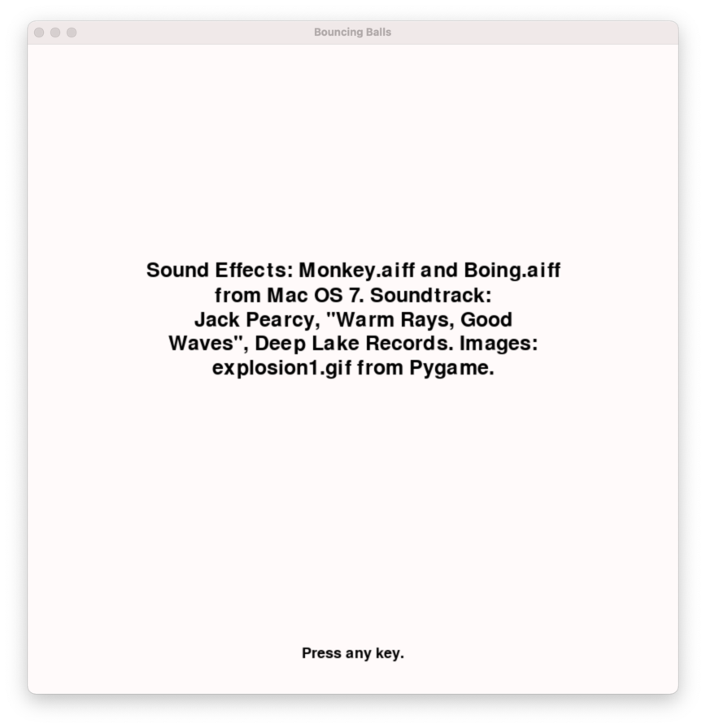

# Bounce

The objectives of this exercise are:

* Use a heirarchy of objects to create a graphical demo using PyGame.
* Understand the connection between a game object and a scene graph.
* Use scene objects to build a linear scene graph.
* Apply planar geometry and 2D vector mathematics to animate balls in a plane.

The program we are creating is not quite a game. It introduces us to objects which we will use to create games. To gain experience working with these objects and Pygame we will make a toy application that is entertaining to watch.

The two abstract base classes that we will use to create our applications are _videogame_ and _scene_.

A _Videogame_ is an object that represents an application with a window that listens for events from human input devices (mouse, keyboard, etc.), can draw sprites, 2D graphics and 3D graphics in the window, play music, play sound effects, and use all the devices that the operating system provides such as a webcam or the computer's disk.

A _Scene_ is an object that represents a specific game view. In our program there will be three scenes in total. There are specific events that move the program from one scene to another. The scenes are organized as a sequence and once the sequence has completed the program exits.

The scenes are:
* Title scene
* Bouncing scene
* Credits

The _title scene_ is pictured below.


At a minimum, the _title scene_ must clearly show the title of the program. It is left to your discretion how the title is presented. It can be as sophisticated or as simple as you desire. To transition to the next scene, any key is pressed.

The _bouncing scene_ is pictured below. There are colored balls which move linearly in the boundaries of the window. In this first screenshot, all the balls are alive and moving. Except for the zeroth ball, all the balls have a finite lifespan. Each time a ball collides with another ball, the ball's life diminishes until the ball is dead. Additionally, the zeroth ball moves at a speed faster than all the other balls in the scene.


Should a ball collide with the boundaries of the window, the ball is reflected off the wall. Should a ball collide with another ball, the ball is reflected off the tangent line formed at the point of contact between the two balls.

Each ball has a lifespan. Everytime a ball strikes another ball, it's lifespan decreases until the ball dies. When the ball dies, it's color changes to white and it's velocity becomes (0, 0). Any subsequent collision with a dead ball causes the dead ball to play an explosion animation.


To help debug the program, each ball has a unique name. The ball's name can be displayed on the screen with a press of a button. An example of how the window will look is shown below. 


After a specific button is pressed, the _bouncing scene_ transitions to the _credits scene_.

The _credits scene_ clearly presents information about the programmer and the contributors to the program. An example of a credit scene (which is missing information about the programmer) is shown below.



Pressing any key from the _credits scene_ exits the program.


## Game Assests and 3rd Party Materials

Please re-read the course rules. In the section titled _Course Rules & Classroom Management_ the following two rules are listed:
* Third party work (code, artwork, etc.) may not be used in student work without prior instructor consent. Failure to gain and document instructor consent will be construed as willful academic dishonesty.
* When a third party’s work is incorporated into student work after gaining instructor consent, failure to wholly document the work’s origin, copyright and license will be construed as willful academic dishonesty.

The course Canvas page has a document titled _Game Assets_. That document has links to sites where you have permission to re-use and adapt game assets for your own game needs so long as you document it.

Should you wish to use assets from anywhere else, please consult your instructor and gain permission first.

## Rules & Requirements
* The program has a square window that is 800 by 800 pixels. Please do not use a window size other than 800 by 800 pixels.
* The title scene is the first scene. It has the title of the program. Pressing any key transitions from the first scene to the second scene.
* The second scene is the bouncing ball scene. The scene continues until the _x_ key is pressed. When the _x_ key is pressed, the scene ends and transitions to the third and final scene.
* The third scene is the credits scene. The credits show who created the program and gives credit to any assests such as music, sound effects, images, etc. that were used to make the game. Pressing any key will exit this scene and end the program.
* There is at least three balls and no more than 49 balls in the bouncing ball scene.
* There is one ball in the bouncing ball scene that is always alive and is significantly faster than all the other balls.
* Each ball is placed randomly and completely within the window. A ball cannot be placed touching or overlapping the window boundaries. A ball cannot be placed touching or overlapping another ball.
* Each ball is initialized with a random velocity vector.
* All the balls have an identical radius of 25.
* Each ball is initialized with a life value between 5 and 10. The life value is selected randomly. Every time the ball collides with another ball the life value diminishes by 1. When the life value reaches 0, the ball is no longer alive.
* A living ball has a color other than white which is selected at random and moves about the screen according to it's velocity.
* A ball that is dead has a life value equal to 0, it turns white, has a velocity of (0, 0), and will play an explosion animation when struck by another ball.
* A ball cannot die overlapping or touching another ball. If two balls overlap, then move the balls apart until they no longer touch or overlap.
* A ball can never leave the boundaries of the window. The window's boundaries are marked with a yellow border.
* The bouncing ball scene has the following events tied to keyboard presses:
    * _a_ toggle (turn on and off) text annotations for all the balls
    * _e_ toggle (turn on and off) explosion animation
    * _p_ toggle (turn on and off) pausing where the scene stops updating
    * _s_ toggle (turn on and off) sound effects
    * _t_ toggle (turn on and off) the soundtrack
    * _x_ exit the scene to the next scene
* Pressing _a_ in the bouncing ball scene will label each ball with a unique name.
* Each scene must have a soundtrack.
* When the ball collides with a wall, there is a sound effect. 
* When the ball collides with another ball, there is a sound effect.
* All the data files and game assests must be stored in `game/data`.
* A `requirements.txt` is required to recreate the Python virtual environment needed to run the application.
* The program must be executable with the command `./bounce.py`, this means `bounce.py` must have a _shebang_.
* All Python source files must have a Pylint score of 9.0 or greater.
* All Python source files must conform to PEP-8.

Required files:
* `bounce.py` the main program
* `game/__init__.py` module init file
* `game/animation.py` example aniation
* `game/ball.py` Ball and circle classes
* `game/game.py` Game logic
* `game/rgbcolors.py` List or RGB colors
* `game/scene.py` Classes that represent game scenes
You may add additional files if you wish.

## Pygame Rect

Understanding the [_Rect_ object](https://www.pygame.org/docs/ref/rect.html) is foundational to understanding how to work with Pygame.

The _Rect_ initializer's parameters are _left_, _top_, _width_, and _height_. The parameters _left_ and _top_ can be thought of as the _x_ and _y_ coordinate of the upper left hand corner of the _Rect_. The parameter _width_ defines how long the _Rect_ is in the _x_ or horizontal direction. The parameter _height_ defines how long the _Rect_ is in the _y_ or vertical direction. From these four parameters, the coordinates for the four vertices can be calculated.

The _Rect_ object has properties, listed below, which can be used to move and align the _Rect_ or analyze the relationship of the _Rect_ to other pieces of geometry. The Pygame documation does not provide explanations for each of these properties yet it is a trivial exercise to create a _Rect_ and explore each of these properties. 
```
x,y
top, left, bottom, right
topleft, bottomleft, topright, bottomright
midtop, midleft, midbottom, midright
center, centerx, centery
size, width, height
w,h
```

## Pygame Surface

Understanding the [_Surface_ object](https://www.pygame.org/docs/ref/surface.html) is critical to learning how to display graphics in Pygame. If you want to display an image or draw an image, a _Surface_ must be used.

Unlike the _Rect_ object, the _Surface_ object only has two required parameters which describe the area the _Surface_ represents, not the position. The parameter _width_ defines how long the _Surface_ is in the _x_ or horizontal direction. The parameter _height_ defines how long the _Surface is in the _y_ or vertical direction.

Most importantly, every _Surface_ has a _Rect_. The method `get_rect()` returns the _Rect_ attached to that _Surface_. Remember that a _Rect_ is a rectangle. This means that although you draw a circle in a _Surface_, the _Surface_ is always bound by a rectangular _Rect_.

## Pygame Math
Take advantage of Pygame's [math library](https://www.pygame.org/docs/ref/math.html). Since we are working with geometry in a plane, the [_Vector2_](https://www.pygame.org/docs/ref/math.html#pygame.math.Vector2) class is particularly valuable. Read through all the methods and make sure you understand how to use them. If not, please share your questions in class or during office.

The [_Vector2_](https://www.pygame.org/docs/ref/math.html#pygame.math.Vector2) class is a building block for most of the other objects one needs to create in a game. Learning how to use it will save you time and energy and yield beautiful, elegant code.

## Pygame Draw

Drawing a circle is not difficult yet it can be challenging for a beginner. Thankfully, Pygame has a rich set of drawing tools which are all described in Pygame's [Draw](https://www.pygame.org/docs/ref/draw.html) module.

To draw a circle, you will need at a minimum a _Surface_ to draw onto, a color, the circle's center, and the circle's radius.

## Colors

Pygame has a [_Color_ class](https://www.pygame.org/docs/ref/color.html) which you can use to manage the color of an element drawn to a _Surface_ or to modify the color of a pixel.

To assist you, the file `rgbcolors.py` contains a very long list of colors which you can refer to by name. Examples of using the colors from this file are given in the sample code provided. 

## Bouncing

There are two types of bounces in the program. The first is ball to ball bouncing and the second is ball to wall bouncing.

Visually, it may appear as though multiple balls are colliding together at the same time yet the program only handles pair-wise collision. This means that given a sequence of balls, a given ball from the sequence will only be checked for touching/overlapping once against all the other balls in the sequence.

There are two steps to bouncing. The first step is determing that the ball has collided with something and the second step is to make the ball bounce.

Do not reinvent the wheel. [Pygame's math library](https://www.pygame.org/docs/ref/math.html) provides objects and functions that greatly simplify bouncing. 

#### Ball to Wall Bounce

Ball to wall collision is the simpliest and it should be completed first before attempting ball to ball bouncing.

To determine if a ball needs to bounce off of a wall is straightforward. The window has a coordinate system with the upper left hand corner as the origin. If our window is 800 x 800, then the image below labels the coordinates for the four corners and the extremal values along the _X_ and _Y_ axis.


With the window's extents (_Xmin_, _Xmax_, _Ymin_, _Ymax_), a ball's center and it's radius is all we need to determine if the ball is touching the window's boundary. Imagine a ball that is touching or overlapping the left edge of the window. This means that the ball's center's _x_ coordinate is within _radius_ units of _Xmin_. In other words, `ball.center.x - ball.radius <= Xmin`. If the ball was touching the right edge of the window, then `ball.center.x + ball.radius >= Xmax`. The same reasoning can be applied for the top and bottom boundaries.

Once it is determined that the ball is touching or overlapping the left or right edges of the window, then you multiply the _x_ component of the ball's velocity by -1. If the ball is touching or overlapping the top or bottom edges of the window, then you multiply the _y_ component of the ball's velocity by -1.

#### Ball to Ball Bounce

Ball to ball collision is marginally more complicated than ball to wall bouncing. 

To determine if two balls are touching or overlapping, calculate the distance from the center of one ball to the center of the other ball. If the distance between the two ball centers is less than or equal to (2 * radius), then the balls are touching or overlapping.


Th next step is to have the balls bounce. Consider the two circles in the figure above. _Circle A_ is touching _Circle B_ at a single point. Through that point is a tangent line. If we draw the radius from the center of _Circle A_ tot he collision point and draw the radius of _Circle B_ from the collision point to it's center, we would see a line segment that is perpendicular to the tangent line. This line segment is the direction the ball must bounch around.

In other words, if we find the normal vector to the tangent line passing through the point of collision, the ball can be [reflected](https://www.pygame.org/docs/ref/math.html#pygame.math.Vector2.reflect) around the normal vector.

Let's imagine we wish to figure out how to make _Circle A_ bounce. We would find the normal vector by taking the difference between _Circle B_'s center and _Circle A_'s center. Next we would assgin _Circle A_'s velocity the [reflected vector](https://www.pygame.org/docs/ref/math.html#pygame.math.Vector2.reflect) around the normal. 

#### Overlapping

Visually, it appears as though the balls touch and then bounce. In actuallity, many of the balls overlap one another and then bounce. Since the balls will eventually die and stop moving, it is important to be able to separate the balls when they are overlapping.

To do this, first find the distance between the two balls. If the distance is less than (2 * radius) then the balls are overlapping. Subtract the true distance between the balls from (2 * radius). This identifies how much the balls are overlapping. Next, divide this distance by 2. If we move one ball by this half distance and the other ball as well, then they will be just barely touching. Add a little bit to the distance to separate the balls. For example:
```python
        distance_between_balls = ball.distance_from(other_ball)
        seperating_distance = (ball.radius * 2.0) + (ball.radius * 0.25)
        if distance_between_balls <= seperating_distance:
            # they are overlapping or just touching
            delta = seperating_distance - dist_between_balls
            half_delta = delta / 2.0
```
We're going to move one ball backwards by _half_delta_ and the other ball backwards by _half_delta_. Using the ball's velocity, scale the velocity vector to have it's length equivalent to _half_delta_ and update the ball's location.

Keeping the balls separated when the ball dies is critical. If a ball dies and then is left overlapping or touching another ball, it will be stuck exploding.

## Don't Forget

Please remember that:

* Don't forget to include a requirements.txt file.
* Direct comparison of floating point values will not work corretly, use the Math library's [`isclose()`](https://docs.python.org/3/library/math.html?highlight=isclose#math.isclose) instead.
* Use [Pygame's documentation](https://www.pygame.org/docs/) to help you complete this assignment.
* You need to put a header in every file per the [instructions](https://docs.google.com/document/d/1OgC3_82oZHpTvoemGXu84FAdnshve4BCvtwaXZEJ9FY/edit?usp=sharing) shared in Canvas.
* You need to follow [PEP-8](https://www.python.org/dev/peps/pep-0008/); use linters and style checkers such as `pycodestyle`, `pylint`, and `black`.
* You need to test your program. If it does not run correctly or if it unplayable then your project will receive poor marks.

# Rubric

This exercise is worth 10 points. There is a total of 15 points possible. Your program must not have any syntax errors before it is graded. Submissions that have a syntax error or throw an uncaught exception will be assigned a score of 0.
* Functionality (9 points): Your submission shall be assessed for the appropriate constructs and strategies to address the exercise. A program the passes the instructor's tests completely receives full marks. A program that partially passes the instructors tests receives partial-marks. A program that fails the majority or all the tests receives no marks.
    * A program that is not defined in separate files using a Python package per the requirements looses 5 points.
    * A project missing it's requirements.txt file looses 5 points.
    * A program that does not have balls bouncing off walls looses 3 points.
    * A program that does not have ball to ball bouncing looses 3 points.
    * A program that does not have sound effects looses 2 points.
    * A program that does not have a sound track looses 2 points.
    * A program that does not have balls with a lifespan looses 2 points.
    * A program that does not have scenes with soundtracks looses 2 points.
    * A program that is missing a _scene_ looses 4 points per missing scene.
    * A program that does not execute with the command `./bounce.py` looses 3 points.
    * A project that does not have the required individual files looses 4 points.
    * Partial implementation of the rules shall loose 1-5 points depending on the number of requirements not met.
* Format & Readability (6 point): Your submission shall be assessed by checking whether your code passess the style and format check, as well as how well it follows the proper naming conventions, and internal documentation guidelines. Git log messages are an integral part of how readable your project is. Failure to include a header forfeits all marks. Not conforming to PEP-8 forfeits all marks.

